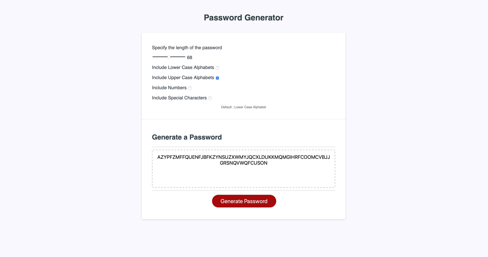

# 03-password-generator
Password generator Random

Generates Random Password based on user selected Character Set

[VISI SITE - Password Generator](https://amitkarmacharya-edu.github.io/03-password-generator/)

#### Possible Bugs - 

  * When no default value/character set is selected, password might be undefined
  * When the password size is small and the character set option is more than one, password must include atleast 1 character form the character set.
  * Must enforce user to pick password length that is between 8 - 128.
